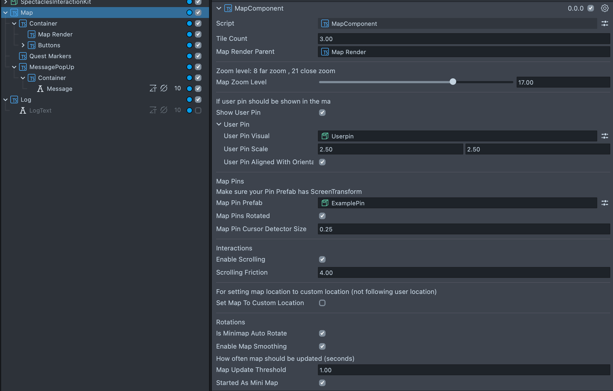

# Outdoor Navigation

[](https://developers.snap.com/spectacles/spectacles-frameworks/spectacles-interaction-kit/features/overview?) [](https://developers.snap.com/lens-studio/features/location-ar/custom-landmarker?) [](https://developers.snap.com/spectacles/about-spectacles-features/compatability-list?) [](https://developers.snap.com/lens-studio/features/location-ar/map-component?) [](https://developers.snap.com/lens-studio/features/remote-apis/snap-places-api?)


> **NOTE:**
> Multiple outdoor navigation features are in the work. For example user "HEADING". This example is an early experimentation.
> Connect your phone to a solid Wifi network and make sure that your spectacles are synced with the spectacles app.

## Overview

This project demonstrates an outdoor navigation system leveraging Snap Spectacles’ Map Component and Places API. Users can orient themselves, select a destination, and navigate to it guided by a virtual pointer and mini map. The system is designed for Spectacles to bring intuitive spatial computing to outdoor navigation.

> **NOTE:**
> This project will only work for the Spectacles platform.

## Design Guidelines

Designing Lenses for Spectacles offers all-new possibilities to rethink user interaction with digital spaces and the physical world.
Get started using our [Design Guidelines](https://developers.snap.com/spectacles/best-practices/design-for-spectacles/introduction-to-spatial-design)

## Prerequisites

- **Lens Studio**: v5.4.0+
- **Spectacles OS Version**: v5.59.218+
- **Spectacles App iOS**: v0.59.1.1+
- **Spectacles App Android**: v0.59.1.1+

To update your Spectacles device and mobile app, refer to this [guide](https://support.spectacles.com/hc/en-us/articles/30214953982740-Updating).

You can download the latest version of Lens Studio from [here](https://ar.snap.com/download?lang=en-US).

The project requires the use of the **Map Component** and **Places API**, available in the Lens Studio Asset Library.

## Map Component Integration



1. **Map Component**:

   - Add the Map Component to your Lens Studio project via the Asset Library. See more [here](https://developers.snap.com/lens-studio/features/location-ar/map-component).

> **NOTE:**
> You can add the map to an image component. In this way the map will show up on the tethered canvas.
> You want to mantain the canvas tethered to the user for an accurate orientation.

2. **Customize the Map**:
   - Modify the map’s mask texture, user pin, and location pins through the Inspector panel.
   - Set up interactions such as scrolling, recentering, or locking the map view as required.

#### Example Script

```javascript
// @input Component.ScriptComponent mapComponent

script.createEvent("OnStartEvent").bind(function () {
  var onMaptilesLoaded = function () {
    var longitude = -0.129956;
    var latitude = 51.51277;
    var mapPin = script.mapComponent.createMapPin(longitude, latitude);
  };

  script.mapComponent.onMaptilesLoaded(onMaptilesLoaded);
});
```

### Places API Integration

The Places API allows developers to retrieve detailed information about nearby locations, such as:

- Place names, descriptions, and types.
- Opening hours and contact details.
- Coordinates and IDs.

See more [here](https://developers.snap.com/lens-studio/features/remote-apis/snap-places-api).

#### Example Script

```javascript
function onReceiveNearbyPlaces(isError, places) {
  places.nearbyPlaces.map((place) => {
    print(place.name + " " + place.placeId);
  });
}

ApiModule.get_nearby_places(null, null, null, null, onReceiveNearbyPlaces);
```

### Navigation Workflow

1. **Set Orientation**: Determine north direction manually. Using a compass open the app in the north direction.
   
2. **Select Destination**: Users pick a nearby location from a predefined list or search via the Places API.
   
3. **Navigate**: Follow the map and AR arrow overlays to reach the destination.
   

### Places API Endpoints

#### Get Nearby Places

Retrieve nearby places:

```javascript
ApiModule.get_nearby_places(null, null, null, null, function (isError, places) {
  print(JSON.stringify(places));
});
```

#### Get Place Profile

Fetch detailed metadata for a single place:

```javascript
ApiModule.get_place(placeId, function (isError, placeMetadata) {
  print(JSON.stringify(placeMetadata));
});
```

## Highlights

### Modify canvas UI


In the Navigation UI you find all of the panel elements like text, images and buttons. Feel free to customize based on your needs.

- Be careful to delete components. Take a look at the Lens Manager section where you see every script logic and its references.
- Take advantage of "PinchButton" EventCallback to reference public functions in your script. The function will be called "OnButtonPinch".


### Understand the Lens Manager


- **LocationDemo**: Define user location using RawLocationModule.
- **SnapchatPlacesDemo**: Finds nearby places using Snapchat Places API and RemoteServiceModule.
- **DefineDestinationDemo**: Defines the coordinate of the destinations and updates DestinationPointer.
- **ObjectToggler**: Utility that helps defining states when clicking on buttons.
- **DestinationPointer**: After selecting destination, points to destination. Move an object 1 km in the direction of the destination and "LookAt" it.
- **NorthPointer**: After starting the experience opening the app facing north, keeps pointing at the North Direction. Move an object 1 km in the direction of North and "LookAt" it.

## Testing the Project

### Lens Studio

1. Open the Preview panel to simulate user location and navigation.
2. Test the orientation slider and destination selection workflows.
3. Verify API responses by logging data in the console.

### Spectacles Device

1. Deploy the project to your Spectacles device.
2. Ensure location services and extended permissions are enabled.
3. Use the navigation interface to test live functionality.

---

## Disclaimer

This project is intended for demonstration purposes. Ensure compliance with Snap Spectacles API usage policies and terms of service when deploying the system.

## Support

If you have any questions or need assistance, please don't hesitate to reach out. Our community is here to help, and you can connect with us and ask for support [here](https://www.reddit.com/r/Spectacles/). We look forward to hearing from you and are excited to assist you on your journey!

## Contributing

Feel free to provide improvements or suggestions or directly contributing via merge request. By sharing insights, you help everyone else build better Lenses.